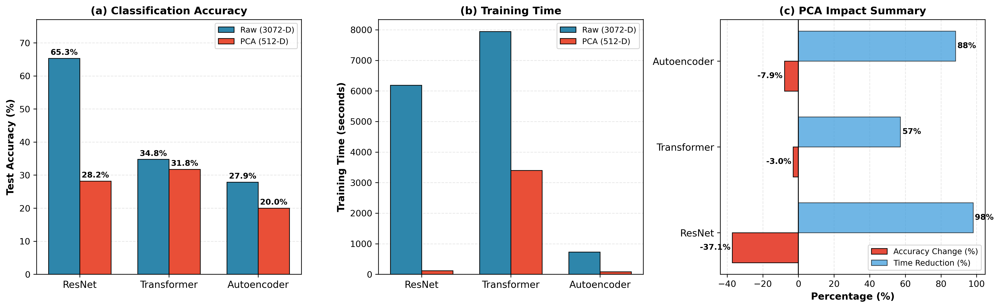
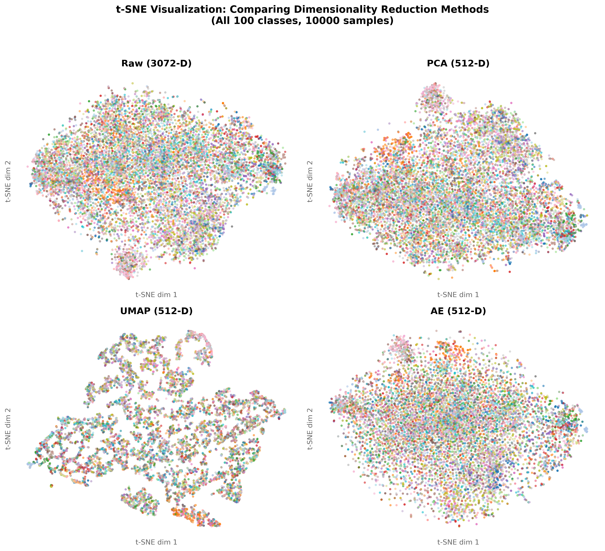

# CIFAR-100 Dimensionality Reduction Comparison

This project compares different dimensionality reduction methods for image classification on CIFAR-100.

## Overview

We compare 3 reduction methods (PCA, UMAP, Autoencoder) against raw features using 3 classifiers (ResNet, Transformer, Autoencoder). This gives us 12 total experiments.

## Requirements

Python 3.8 or higher

### Install dependencies

```
pip install torch torchvision
pip install numpy
pip install pandas
pip install matplotlib
pip install scikit-learn
pip install umap-learn
pip install joblib
```

Or install all at once:

```
pip install torch torchvision numpy pandas matplotlib scikit-learn umap-learn joblib
```

## Project Structure

```
project/
    scripts/
        config.py                    # Configuration and hyperparameters
        main.py                      # Run full pipeline
        0_prepare_data.py            # Download CIFAR-100 and apply reductions
        1_resnet_classifier.py       # Train ResNet on all input types
        2_transformer_classifier.py  # Train Transformer on all input types
        3_autoencoder_classifier.py  # Train Autoencoder on all input types
        4_compare_results.py         # Generate plots and comparison
    data/                            # Created automatically
    results/                         # Created automatically
    models/                          # Created automatically
```

## How to Run

### Option 1: Run full pipeline

```
cd scripts
python main.py
```

This will run all steps in order and takes several hours on CPU.

### Option 2: Run steps individually

```
cd scripts
python 0_prepare_data.py
python 1_resnet_classifier.py
python 2_transformer_classifier.py
python 3_autoencoder_classifier.py
python 4_compare_results.py
```

## Configuration

All hyperparameters are in config.py:

- REDUCED_DIM: Target dimensions for reduction (default 512)
- EPOCHS: Training epochs for classifiers (default 30)
- BATCH_SIZE: Batch size for training (default 128)
- LEARNING_RATE: Learning rate (default 0.001)

## Outputs

After running, check the results folder for:

- comparison_plots.png: Accuracy and training time charts
- tsne_comparison.png: t-SNE visualization of feature spaces
- combined_results.csv: All accuracy and timing results
- Individual CSV files for each classifier

## Methods

### Dimensionality Reduction

- Raw: Original 3072-D flattened images
- PCA: Linear reduction to 512-D (retains 95.23% variance)
- UMAP: Nonlinear manifold projection to 512-D
- Autoencoder: Neural network compression to 512-D

### Classifiers

- ResNet-50: Transfer learning from ImageNet (raw) or MLP (reduced)
- Transformer: 4 encoder layers with 8 attention heads, trained from scratch
- Autoencoder Classifier: Joint reconstruction and classification loss

## Results Summary

### Classification Accuracy

| Model | Raw | PCA | UMAP | AE |
|-------|-----|-----|------|-----|
| ResNet | 65.82% | 28.69% | 10.07% | 28.75% |
| Transformer | 35.45% | 30.79% | 1.00% | 27.74% |
| Autoencoder | 27.68% | 20.22% | 8.20% | 20.57% |

### Accuracy and Training Time Comparison



### Feature Space Visualization (t-SNE)



### Key Findings
- Raw features with ResNet (transfer learning) achieved the best accuracy
- UMAP failed for high-dimensional reduction (1-10% accuracy)
- PCA and Autoencoder reduction performed similarly (around 26%)
- Dimensionality reduction reduced training time by 50-98%

## Authors

Sahil Dadhwal, Purva Khadke, Sarvesh Halbe

<!-- Note: LLMs were used at a surface level to: help create this readme, and help the presentation slides look nicer, and help brainstorm things that would speed up computation time (this is why we started ti save the models locally), -->